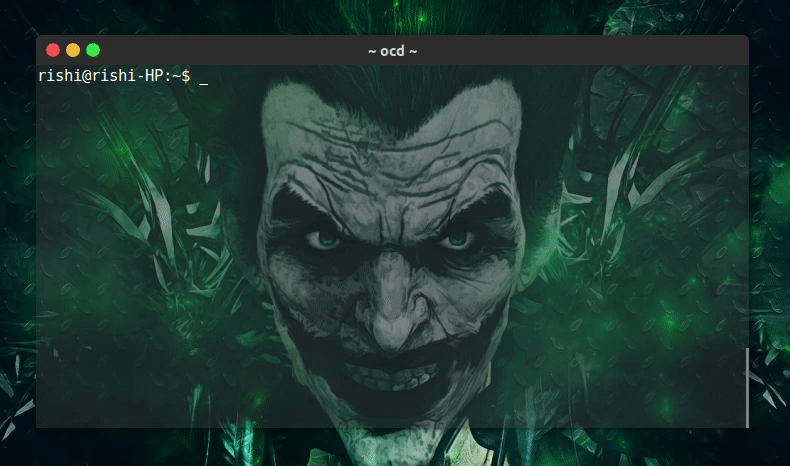

<h1 align="center">
	<br>
	
	<br>
	<br>
</h1>

> :tada: Daily injection of wisdom, fun and love throughs command line

[](https://travis-ci.org/CodeDotJS/kote)

## Install

- `Ensure you've` __[`NodeJS`](http://nodejs.org)__ `version >= 4 installed. Then run the following :`

```sh
$ npm install --global kote
```
__OR__
```sh
$ sudo npm install --global kote
```

## Usage

```
 Usage: kote <command>

 Command: 
  -g, --goodreads        fetch quote of the day from goodread       
  -b, --brainyquote      fetch quote of the day from brainyquotes   
  -e, --eduro            quote of the day by eduro                  
  -l, --love             romantic quote of the day                  
  -a, --art              art quote of the day                       
  -n, --nature           nature quote of the day                    
  -f, --funny            funny quote of the day                     

 Kote: 
  -h, --help             display help
  -e, --extra            extra information
  -v, --version          display kote's version
```

## License

MIT &copy; [Rishi Giri](http://rishigiri.com)
